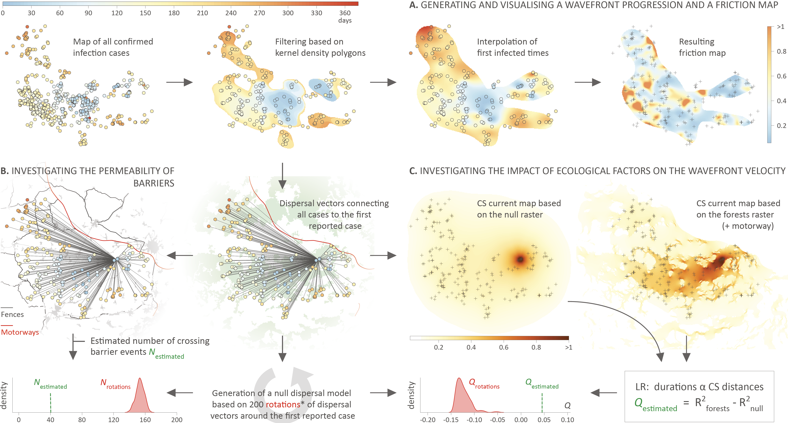

This repo gathers the input files and scripts related to our study entitled "**Unravelling the dispersal dynamics and ecological drivers of the African swine fever outbreak in Belgium**" ([Dellicour *et al*. 2020](https://besjournals.onlinelibrary.wiley.com/doi/10.1111/1365-2664.13649), *Journal of Applied Ecology*). R scripts related to the analyses are all gathered within the file `R_script_ASFV.r`.

Abstract: African swine fever is a devastating disease of domestic pigs and wild boars caused by African swine fever virus (ASFV). ASFV originates from sub-Saharan African countries. In the last 10 years, the virus left its endemic range to spread to eastern Europe and Russia. On September 2018, Belgian authorities reported that ASFV had been detected in two wild boars in a southern area of the country. One year later, no domestic pig has been infected, with the last ASFV-positive wild boar being confirmed in mid-August 2019, suggesting that the outbreak is now controlled. However, the dispersal dynamics as well as the specific impact of ecological factors and intervention measures on the outbreak remain unknown. In total, 827 positive cases have been reported in wild boar populations. In this study, we exploit the resulting spatio-temporal distribution of occurrence data to investigate the wavefront progression. We first present the application of recently developed methods to quantify the local wavefront velocity of an invading epidemic. Second, we develop and apply a novel analytical framework that uses occurrence data to investigate the impact of ecological factors on the dispersal dynamics of a wavefront progression. Our analyses highlighted that the network of barriers, involving installed fences, had an impact on both the effective dispersal and the wavefront dispersal velocity. Furthermore, we also demonstrated that the wavefront progression was slower outside forest areas. Together, these results have concrete implications for potential future ASFV epidemics in similar regions. Overall, we here describe a novel analytical approach that exploits occurrence data to investigate the impact of ecological factors on the wavefront velocity and actual wavefront progression. This methodology has the potential to be quickly applied to outbreak datasets solely made of occurrence data, with key benefits for the epidemiological investigations of external spatial factors impacting pathogen dispersal across non-endemic areas. Our analytical workflow could also be further applied to investigate the impact of ecological factors on any kind of biological dispersions (pathogen spreads, invasive species).

**Figure: analytical workflow implemented and applied to analyse the dispersal dynamics and drivers of the African swine fever virus (ASFV) outbreak in the wild boar population of southern Belgium.** 'SL', 'CS', and 'LR' refer to 'straight-line', 'Circuitscape' and 'linear regression', respectively. Circuitscape cumulative current maps are here log10-transformed and obtained when connecting each infection case to the first detected case. These maps are thus illustrative of the Circuitscape path model used to compute the ecological distances involved in the linear regression analyses (similar tests were performed by considering the least-cost path model, see the text for further details). (\*) Stochastic rotations of dispersal vectors were performed by respecting the proportion of filtered cases falling within (75.4%) or outside (24.6%) forest areas.
